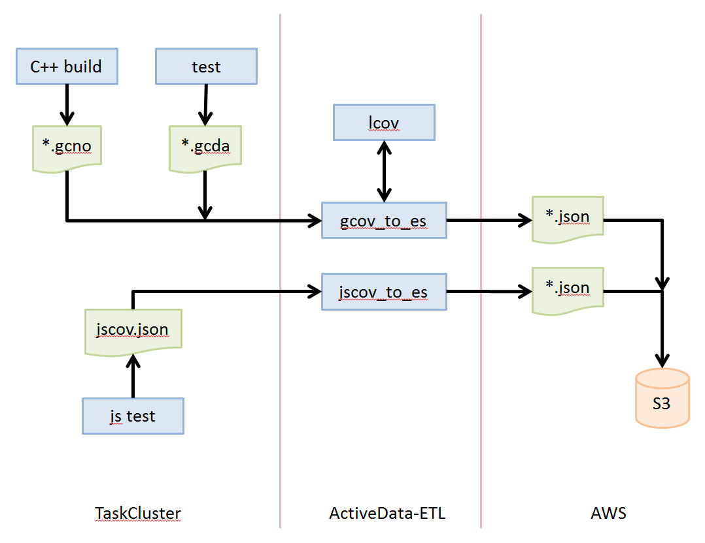
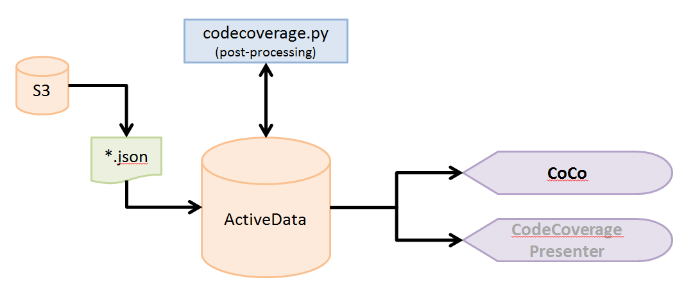

#Project CodeCoverage

##Summary 

Collect code coverage across may platforms and languages and present in a unified view.

##Use cases / Motivation

CodeCoverage data can provide the following benefits

* Individual developers get a view into what sections of code are covered by tests
* Deliver metrics about how well source is covered:
  * Coverage metrics at any directory, or individual file level  
  * How well net-new code is covered
  * How much coverage is increasing, or decreasing
  * How coverage differs between platforms, or in aggregate over all platforms
* Knowing what tests cover what source files can answer the following questions:
  * Which tests duplicate coverage?
  * What is the minimum number of tests that can cover a given source file, or directory?
  * For a given changeset, what tests should be run?

##Why!?

Codecoverge metrics, especially the differential measures, can provide hints about the direction of product quality. It can also point to severely under-tested source code, especially important when that source code is in flux.

##Architecture

The current design uses ActiveData;

* It centralizes the large amount of coverage details for easy aggregation
* ETL code, and front end code, is stateless
  * Development can proceed proceed on each component without blocking others
  * Experiments in the ETL pipeline to run independently of experiments in UI. 

### ETL Pipeline

Each lanaguage's code coverage tool will generate its own unique output.  That data is converted to a standard format: At a granularity of line-level, it includes common annotations like source file, platform and language, along with annotations for testname and sourcemethod when possible, depending on our resources. 

### Frontend

The fine detail of the ETL pipeline is aggregated by `codecoverage.py` to provide statistics of overlap between tests/chunks/or suites. The front end (named CoCo) is static page React app that uses ActiveData directly. 

### Unresolved questions

* incomplete

###Consideration of Coveralls

A review (2015) showed a few shortcomings:  

* Could not merge multiple chunks of suites into one coherent view
* Could not perform minimum cover calculations, or platform deltas 
* Prohibitive price for the many billions of coverage records we would send to Coveralls 

###Consideration of #`lcov` HTML output

Has all the same drawbacks of Coveralls, but with better monetary cost. There is nothing preventing us from turning this on, except maybe computational cost, as `lcov` is proving slow at our size. 

##Time Frame

This project has been running with various levels of low priority for years. The past year has had UCOSP students experiment with visualizations, building the ETL pipeline, and fixing tests to run with code coverage enabled.  

##Tracking Progress

* **UCOSP Progress** - [https://public.etherpad-mozilla.org/p/code_coverage_w17](https://public.etherpad-mozilla.org/p/code_coverage_w17)
* **add some bug numbers here**

## Additional Details

* [The 2017 Winter term has four UCOSP students working on the CodeCoverage project](https://public.etherpad-mozilla.org/p/code_coverage_w17). Specifically, they are working on enabling and improving the CodeCoverage architecture for a single course credit; just one of five other credits for the term. Since they are not on this full time, it is important we do not change the definition of what they are working on.

* **Project Page** - [https://wiki.mozilla.org/EngineeringProductivity/Projects/CodeCoverage](https://wiki.mozilla.org/EngineeringProductivity/Projects/CodeCoverage)

